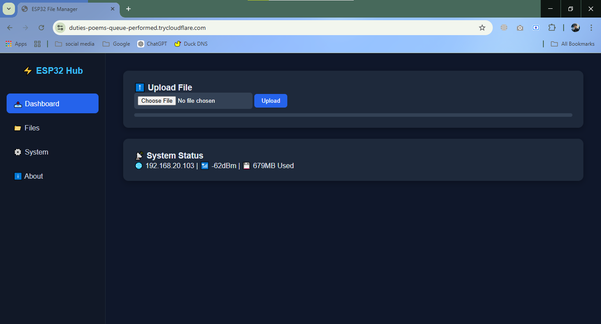
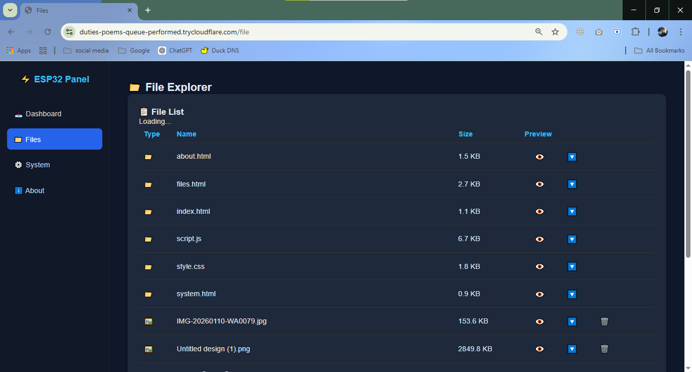
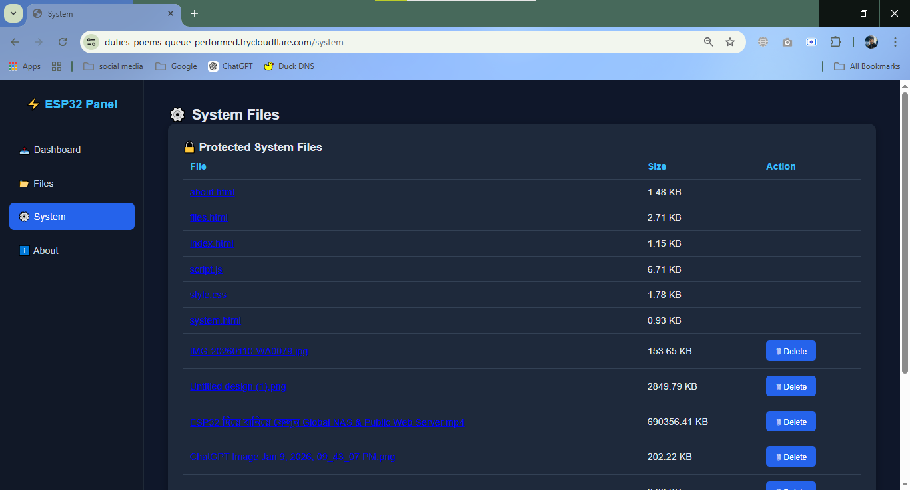
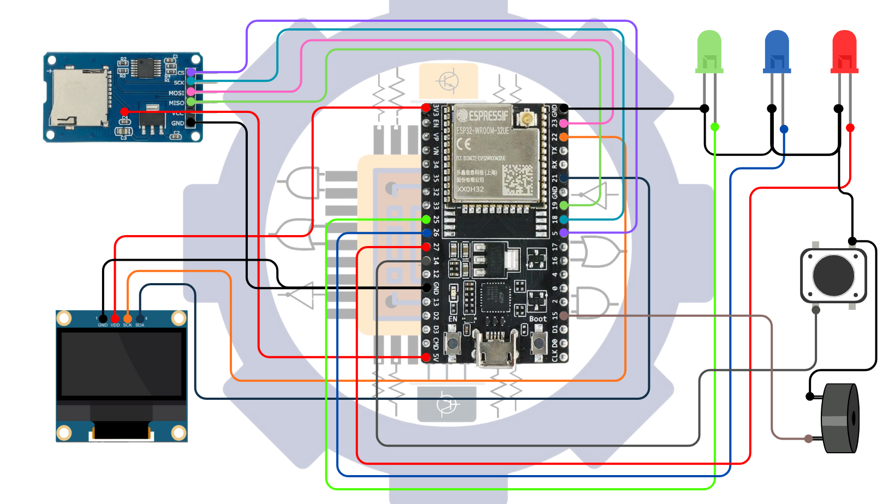
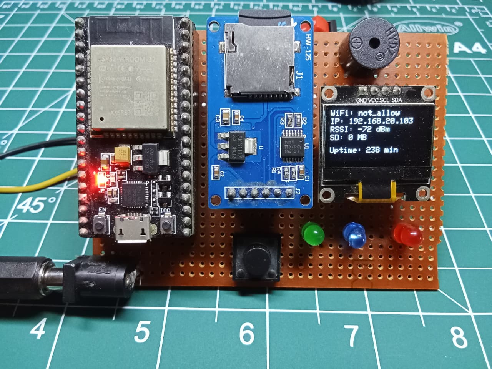

# 🌍 ESP32 Global NAS & Public Web Server
> Build Your Own Personal Cloud Using ESP32 ☁️ This project demonstrates how to build a **Global NAS (Network Attached Storage)** and **Public Web Server** using an ESP32.


---

## 📌 Table Of Contects

- <a href="#overview">Overview</a>
- <a href="#features">Features</a>
- <a href="#hardware-components">Hardware Components</a>
- <a href="#web-server">Web Server</a>
- <a href="#circuit-diagram">Circuit Diagram</a>
- <a href="#project-structure">Project Structure</a>
- <a href="#how-t-works">How It Works</a>
- <a href="#setup-guide">Setup Guide</a>
- <a href="#future-improvements">Future Improvements</a>
- <a href="#video-tutorial">Video Tutorial</a>
- <a href="Author--Contact">Author & Contact</a>

---
<h2><a class="anchor" id="overview"></a>Overview</h2>

ESP32 Global NAS & Public Web Server is a lightweight personal cloud system built using ESP32, SD Card storage, and an OLED display. It allows users to upload, download, delete, preview, and share files globally through a public URL using Cloudflare or Ngrok tunnel.

This project combines IoT, embedded systems, and web server technology to create a low-cost, self-hosted cloud storage solution fully controlled by the user.

---

<h2><a class="anchor" id="features"></a>Features</h2>


- 🌐 Global NAS / FTP + Local Access
- 💾 Suppoet Any Kind of Files Like (Image, Video, Audio, TXT, INO, HTML, CSS, JAVA, Py)
- 📩 Upload Upto 10 MB
- 📂 File Upload / Download / Delete
- 🔍 File Preview Support
- ☁️ Public URL Access
- 📊 OLED Real-Time Upload Progress
- 🔐 Hidden System Files (Admin Mode Uncomplete) 
- 🔄 Auto Refresh File List
- 🎨 Clean Dashboard UI

---

<h2><a class="anchor" id="hardware-components"></a>Hardware Components</h2>


| Components   | Description    |  Quintity       |
| :---         |     :---:      |      :---:      |
| ESP32        | Main Microcontroller |  01     |
| SD Card Module| Stroage      |  01      |
| 0.93/1.03 Inch Oled Display |  System Status      |  01      |
| LED (Red, Blue, Green)  |   Status      |  03     |
| Buzzer |   Status      |  01      |
| Tactile Switches |  Board Reset     |  01      |


---

<h2><a class="anchor" id="web-server"></a>Web Server</h2>

## 📸 Screenshots

### 🖥 Web Dashboard


### 🖥 Web File


### 🖥 Web System


---
<h2><a class="anchor" id="circuit-diagram"></a>Circuit Diagram</h2>

### 🖥 Main Diagram


### 📊 OLED Upload Progress



---
<h2><a class="anchor" id="project-structure"></a>Project Structure</h2>

## Project Structure

```
ESP32_GLOBAL_FILE_MANAGE_SERVER/
│
├── CloudFlare
│   └── cloudflared-windows-amd64.exe
│
├── Diagram
│   ├── ESP32_Embedded_HTTP_File_Server_0.93_Inch_OLED_Display_Circuit_Diagram.png
│   ├── ESP32_Embedded_HTTP_File_Server_Main_Circuit_Diagram_LED_Switch_Buzzer.png
│   ├── ESP32_Embedded_HTTP_File_Server_SD_Card_Module_Circuit_Diagram.png
│   └── ESP32_Embedded_HTTP_File_Server_Main_Circuit_Diagram.png
│
├── Program
│   └── ESP32_Global_Server_System.ino
│
├── Web Page Resources
│   ├── about.html
│   ├── files.html
│   ├── index.html
│   ├── script.js
│   ├── style.css
│   └── system.html
│
├── WebServer
│   ├── Dashboard.png
│   ├── Delete.png
│   ├── Files1.png
│   ├── Preview.png
│   └── System.png
│
└── README.md
```

---

<h2><a class="anchor" id="how-t-works"></a>How It Works</h2>

## How It Works

```

├── ESP32 Hosts a Local Web Server
│   └── The ESP32 runs an embedded HTTP web server that handles client requests such as file upload, download, delete, 
        and preview operations.
├── SD Card as Storage System
│   └── All files are stored and managed inside the connected Micro SD Card module, which acts as the NAS storage backend.
├── Tunnel Service Creates Public Access
│   └── A tunneling service Cloudflare  securely exposes the local ESP32 server to the internet by mapping it 
        to a public URL. 
├── TUsers Access via Public URL
│   └── Anyone with the generated public link can access the web dashboard from anywhere in the world to manage files 
        (based on system permissions).       

```
---
<h2><a class="anchor" id="setup-guide"></a>Setup Guide</h2>

### Install Required Libraries
- WiFi.h
- WebServer.h
- SD.h
- SPI.h
- Adafruit_SSD1306
- Adafruit_GFX

---
<h2><a class="anchor" id="future-improvements"></a>Future Improvements</h2>

### 🔮 Future Improvements

- User Authentication System
- HTTPS (SSL/TLS) Integration
- Multi-User Access Control
- File Encryption
- 24/7 Long-Term Stability
- Mobile App Interface
- Others Major Upgrade

---
<h2><a class="anchor" id="video-tutorial"></a>Video Tutorial</h2>
## 🎥 Project Demo Video

Watch the full walkthrough of this ESP32 Global NAS & Public Web Server on YouTube:

📺 **[Watch on YouTube](https://www.youtube.com/watch?v=luJ0RvVvqgs)**

[](https://www.youtube.com/watch?v=luJ0RvVvqgs)

> Click the image above to play the video.


---
<h2><a class="anchor" id="Author--Contact"></a>Author & Contact</h2>
---

## 👨‍💻 Author

**Micro Tronic BD**  
Bangla IoT & Automation Project Creator  

Passionate about ESP32, IoT, Embedded Systems, and Automation Projects.  
Building practical electronics solutions and sharing knowledge in Bangla/English.

---

## 📬 Contact

```
📧 Email: microtronicbd@gmail.com 
🌐 Website: https://sites.google.com/view/microtronicbd/home  
📘 Facebook: https://www.facebook.com/microtronicbd
📷 Instagram: https://www.instagram.com/micro.tronic/
▶ YouTube: https://www.youtube.com/@MicroTronicbd 
🔗 LinkedIn: https://linkedin.com/company/microtronicbd
```
---

⭐ If you like this project, consider giving it a star!
